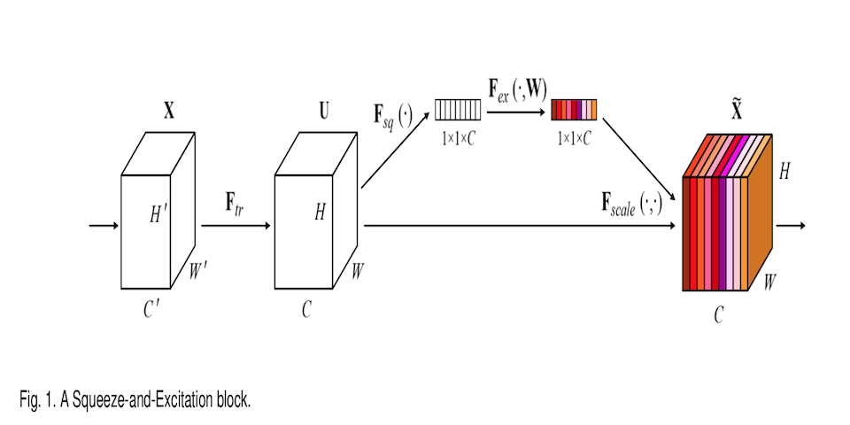
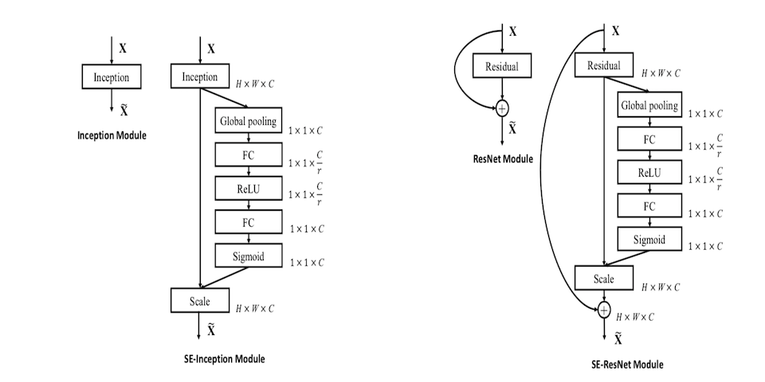
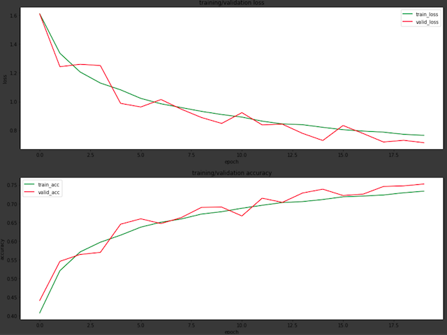
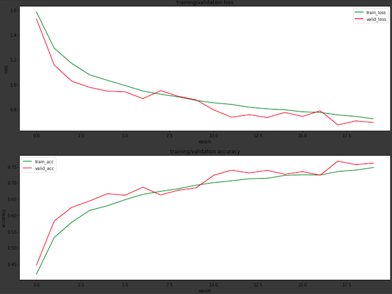

# Squeeze-and-Excitiation Networks

## Environments
keras version : 2.2.5  
python version : 3.6.4

## Info
 
This repo is the implementation of Squeeze and Excitation Networks, which can be used in Keras framework.  
In fact, it is more like a block. Here is the architecture of SEblock: 

There are two part of this block, squeeze and excitiation.  
 
**Squeeze**  
In this part, first it turn 2D feature maps into 1D feature maps. (Batch_size, H, W, C) -> (Batch_size, 1, 1, C)  
Then it feed the tensor into a Dense(fully-connected) layer which might has less filters/units number than input filters/units.  
This reduction of filters/units is for saving the computation power.  
It can output the feature maps are so call channel descriptor in the original article, which aggregating feature maps across their spatial dimension.  
It is similar to concept of embedding which can produce the effect like putting the global receptive field information in each channels.  
 
**Excitiation**  
In this part, it will go through a Dense(fully-connected) layer which has the same filters/units number as input filters/units.  
Then use sigmoid activation to produce the weights for each channel of original tensor.  
It uses these weights to learn the importance of dependencies of each channel.  
In the end, the weights multiply to its corresponding channel in original tensor to enhance/decrease the importance.  
 
 
This block can be implemented in almost any kinds of famous neural network, like ResNet, Inception... 
The author also mention that how to add the SEBlock into these famouse architectures.  

 

## Try it on small CNN

I had simply implemented this block into small CNN to deal with Cifar10 classification problem.  
It worked very well, and only increase the computation effort a little.  
Here is the result compare of regular CNN and regular CNN + SENet  
 
 
Regular CNN  

SE CNN  

 
 
Validation on testing data  
Regular CNN :  loss 0.717884089794159, accuracy 0.7539200000190734 
SE CNN : loss 0.6834373204803467, accruacy 0.7627999999809265

## Reference:
1.https://arxiv.org/abs/1709.01507 
2.https://github.com/titu1994/keras-squeeze-excite-network

